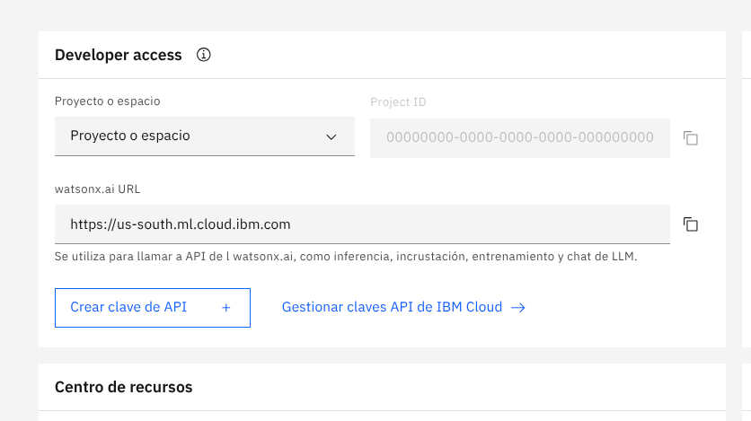

# 🧪 Setup your IBM watsonx Credentials

To use RobotU Molkit’s AI-powered features — like query enrichment and semantic embeddings — you need to authenticate with **IBM watsonx.ai** using two credentials:

- **API Key**
- **Project ID**

These credentials allow secure access to IBM’s Granite models for molecular understanding.

---

## 🔐 Where to Get Your Credentials

1. Go to [watsonx.ai](https://dataplatform.cloud.ibm.com/)
2. Select your project (e.g., **watsonx Challenge Sandbox**)
3. On the **Developer access** panel:
   - Copy your **Project ID**
   - Note the **watsonx.ai URL** (e.g., `https://us-south.ml.cloud.ibm.com`)
   - Click **"Crear clave de API"** to generate your API key

This is visually shown in the image below:

---

## 📎 Useful Setup Guides

- [🔧 Getting Started with IBM watsonx (Tutorials)](https://www.ibm.com/docs/en/watsonx/w-and-w/2.1.0?topic=getting-started-tutorials)
- [🔑 How to Generate an API Key (Step-by-Step)](https://www.ibm.com/docs/en/watsonx/w-and-w/2.1.0?topic=tutorials-generating-api-keys)

Once you have your Project ID and API key, you’ll be ready to connect RobotU Molkit to IBM’s AI infrastructure and start exploring molecules semantically.
